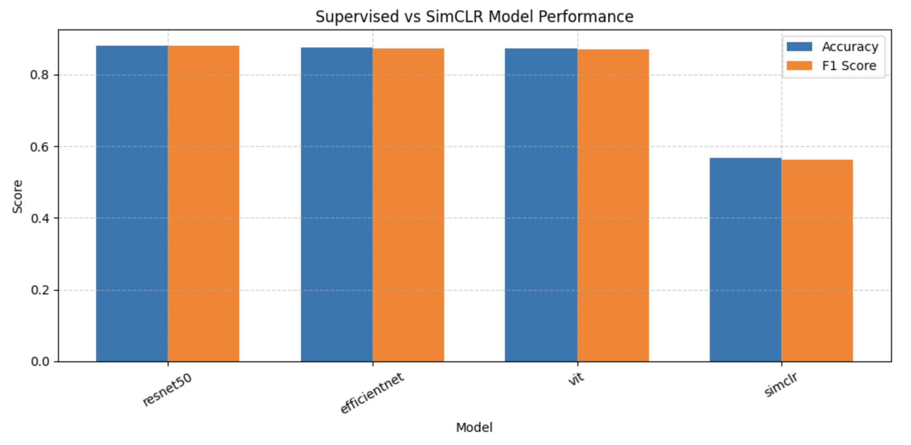

# Representation Learning Trade-offs in Gastrointestinal Endoscopy Imaging (Kvasir v2)

A controlled experimental study comparing supervised transfer learning and contrastive self-supervised pretraining (SimCLR) for gastrointestinal endoscopy image classification.

This repository emphasizes quantitative evaluation, reproducibility, and critical analysis of representation learning strategies in medical computer vision.

---

## Overview

This study evaluates representation learning paradigms on the Kvasir v2 dataset under identical preprocessing, data splits, and optimization settings to isolate architectural and training effects.

Benchmarked approaches:

- **Supervised transfer learning** (ResNet50, EfficientNet-B0, ViT-B/16)
- **Contrastive self-supervised pretraining** (SimCLR)
- **Exploratory feature-injected segmentation prototype** (U-Net variant)

---

## Role & Contribution

This project was developed as part of a 2-person team.

I served as the core model developer and was responsible for:

- Designing and implementing the full supervised benchmarking pipeline
- Implementing SimCLR contrastive pretraining and fine-tuning workflow
- Creating stratified 64/16/20 data splits
- Developing evaluation metrics (Accuracy, Macro F1, ROC/PR analysis)
- Running controlled experimental comparisons across architectures

My teammate contributed to analysis documentation and presentation preparation.

---

## Dataset

**Kvasir v2 — A Gastrointestinal Tract Endoscopy Dataset**

- Source: https://www.kaggle.com/datasets/plhalvorsen/kvasir-v2-a-gastrointestinal-tract-dataset
- Total images: 8,000
- Classes: 8 GI findings
- Images per class: 1,000 (perfectly balanced)
- Input resolution: 224×224
- Normalization: ImageNet mean/std

### Class Distribution

- dyed-lifted-polyps (1000)
- dyed-resection-margins (1000)
- esophagitis (1000)
- normal-cecum (1000)
- normal-pylorus (1000)
- normal-z-line (1000)
- polyps (1000)
- ulcerative-colitis (1000)

### Data Split

A stratified split was used:

- 64% Training
- 16% Validation
- 20% Test

This ensures stable macro-F1 evaluation and prevents data leakage.

---

## Experimental Setup

### Supervised Transfer Learning

Pretrained ImageNet models were fully fine-tuned.

- Input size: 224×224
- Optimizer: Adam
- Learning rate: 1e-4
- Loss: CrossEntropyLoss
- Batch size: 32
- Metrics: Accuracy, Macro F1

Backbones evaluated:
- ResNet50
- EfficientNet-B0
- ViT-B/16

---

### Self-Supervised Learning (SimCLR)

Contrastive pretraining was implemented to evaluate representation quality without labels.

- Encoder: ResNet18
- Projection head: 128-dimensional MLP
- Loss: NT-Xent
- Temperature: 0.5
- Pretraining epochs: 5
- Fine-tuning epochs: 5

After pretraining, a linear classifier was trained and evaluated on the same held-out test set.

---

## Results

### Supervised vs Contrastive Learning



### Test Performance

| Model                | Accuracy | F1 Score |
|----------------------|----------|----------|
| EfficientNet-B0      | 0.8919   | 0.8917   |
| ResNet50             | 0.8888   | 0.8879   |
| ViT-B/16             | 0.7956   | 0.7680   |
| SimCLR (Fine-tuned)  | 0.5672   | 0.5615   |

---

## Key Insights

- EfficientNet-B0 achieved the strongest performance.
- ResNet50 performed comparably, reinforcing the value of convolutional inductive bias in moderate-scale medical datasets.
- ViT underperformed relative to CNNs in this data regime.
- Short-horizon SimCLR pretraining did not surpass supervised transfer learning.
- Strong ImageNet initialization provided richer inductive bias than limited contrastive pretraining under dataset constraints.

These findings highlight the importance of pretraining scale, training duration, and model inductive bias in medical imaging workflows.

---

## Segmentation Prototype (Exploratory)

A feature-injected U-Net variant using ResNet50 encodings was prototyped on Kvasir-SEG.

- Mean IoU: 39.23%

This experiment explores cross-task representation reuse between classification and segmentation, but is not fully optimized.

---

## Repository Structure

## Repository Structure

```
medical-representation-learning-kvasir/
│
├── notebooks/
│   └── kvasir_supervised_vs_simclr_pipeline.ipynb
│
├── results/
│   └── supervised_vs_simclr_comparison.png
│
├── requirements.txt
├── LICENSE
└── README.md
```

---

## Installation

```bash
git clone https://github.com/Mohd-Abdul-Rafay/medical-representation-learning-kvasir.git
cd medical-representation-learning-kvasir
pip install -r requirements.txt
```

---

## Reproducibility Notes

•	Fixed preprocessing and stratified splits
•	Identical evaluation pipeline across models
•	All reported metrics are from held-out test data

---

## Author

**Abdul Rafay Mohd**  
Artificial Intelligence | Medical AI | Computer Vision 

---

## License

This project is licensed under the terms of the [MIT License](LICENSE).

---

## Citation

If this work is useful in your research, please cite:

```bibtex
@software{rafay2026medicalrepresentation,
  author  = {Abdul Rafay Mohd},
  title   = {Representation Learning Trade-offs in Gastrointestinal Endoscopy Imaging (Kvasir v2)},
  year    = {2026},
  url     = {https://github.com/Mohd-Abdul-Rafay/medical-representation-learning-kvasir}
}
